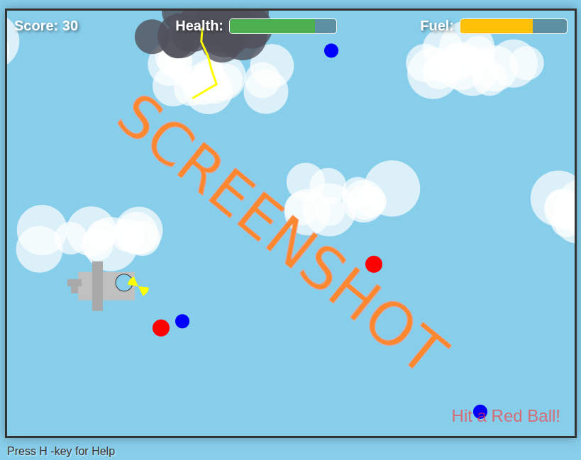

# js_hugoflights

# 🛩️ Side-Scrolling Flyer

## Play it now: https://pemmyz.github.io/js_hugoflights/

**Side-Scrolling Flyer** is a web-based, Flappy Bird–inspired and Hugo Flying Level -game with more action, clever bots, and developer tools. Dodge obstacles, collect blue balls for fuel and score, and see how long you can survive—*or let the built-in bot play for you!*

## Features

- 🌞 **Day and Night Flight Modes**
- 🤖 **Autopilot Bot** with 4 personalities (Collector, Smart, Avoider, Kamikaze)
- ⚡ **Thunder Clouds** (advanced hazards)
- 🟦 **Collectibles:** Blue balls (fuel + score), Red balls (damage)
- 🎮 **Keyboard, Mouse, and Touch Controls**
- 🛠️ **Built-in Developer Tools** (show hitboxes, bot path, target)
- 🔊 **Custom Web Audio** (engine, collect, damage)
- 📊 **Animated Health & Fuel HUD**
- 📈 **Responsive overlay UI** for help, start, and game over screens

---

## How to Play

- **Fly up:** Press `Space`, `Arrow Up`, or Tap/Click the canvas  
- **Avoid:** Red balls and thunder clouds  
- **Collect:** Blue balls for points and fuel  
- **Survive:** Game ends if you run out of health or fuel

### Heads-Up Display

- **Score:** Points earned by collecting blue balls  
- **Health Bar:** Damaged by red balls and thunder clouds  
- **Fuel Bar:** Depletes as you fly, refilled by blue balls

---

## Controls

| Action                | Control                        |
|-----------------------|-------------------------------|
| Fly Up                | Space / Arrow Up / Tap/Click  |
| Show Help             | H key or "Help" button        |
| Start Day/Night       | Buttons on Start Screen       |
| Toggle Autopilot Bot  | B key (in-game)               |
| Switch Bot Personality| 1 / 2 / 3 / 4 (in-game)       |
| Toggle Developer Mode | D key (in help menu)          |

### Bot Modes

- **1:** Collector (chases blue balls, ignores threats)
- **2:** Smart (collects safely, avoids danger)
- **3:** Avoider (dodges all threats, ignores collectibles)
- **4:** Kamikaze (recklessly seeks threats!)

### Developer Tools (press **D** in Help menu)

- Show hitboxes, bot path, and bot target

---

## How to Run

1. **Download** or **clone** this repository
2. Open `index.html` in any modern web browser (Chrome, Firefox, Edge, etc.)
3. Enjoy!

> No install, server, or build step needed!

---

## Audio Controls

- Adjust volume slider in Help menu
- Mute/Unmute button also available

---

## License

MIT License — see [LICENSE](LICENSE) for details.

---

## Credits

- Game design & code: AI/pemmyz
- Powered by HTML5 Canvas and vanilla JavaScript

---

## Development Notes

- Supports desktop and touch devices
- All assets are procedurally generated (no external images required)
- For bugs and feature requests, [open an issue](https://github.com/pemmyz/js_hugoflights/issues)

---

## 🛫 Good luck, pilot!
